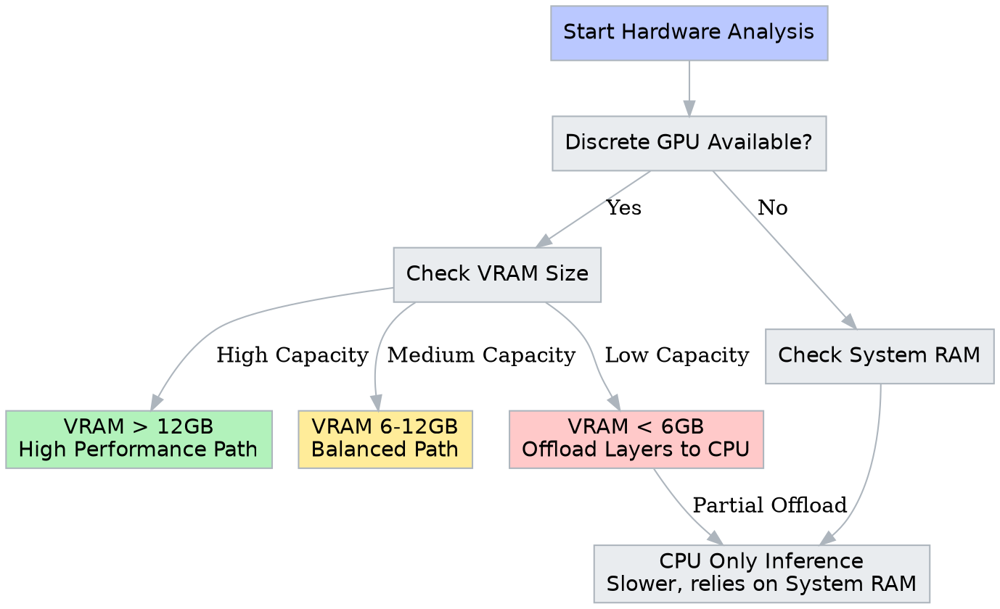

# Building a Customized Local AI Assistant

来源：[原课程](https://apxml.com/zh/courses/getting-started-local-llms)

[返回课程目录](README.md)

This project focuses on the practical implementation of a Large Language Model (LLM) on your personal hardware. Configure a local inference environment, select models appropriate for your specific hardware constraints, and optimize them for a domain or task of your choice. This process requires analyzing trade-offs between model size, quantization, and inference speed, providing a grounded understanding of how these systems operate outside of managed server environments.

## 1. Hardware Profiling and Environment Configuration

Before downloading models, you must determine the operational limits of your machine. Local LLMs rely heavily on system RAM (for CPU inference) or VRAM (for GPU inference). 

Analyze your system specifications. Identify your total available RAM and, if applicable, your GPU's VRAM. This hard constraint dictates which models you can run. For instance, a 7-billion parameter model at 4-bit quantization typically requires around 4-6 GB of memory, while a 70-billion parameter model might require 40 GB or more.

Use the diagram below to trace the decision logic for setting up your environment based on hardware availability.



> Logic flow for determining the appropriate inference strategy based on hardware constraints.

Select a local inference tool compatible with your operating system (such as LM Studio, Ollama, or GPT4All). Install the software and verify that it can access your hardware acceleration if available (e.g., Metal on Mac, CUDA on Nvidia, or AVX instructions on CPU).

## 2. Model Selection and Comparative Analysis

Go to a model repository like Hugging Face. Your objective is to find models that fit the constraints identified in the previous step.

Choose a specific domain or topic that interests you for this project. This could be anything from technical documentation assistance, creative fiction writing, historical analysis, or code generation. The subject matter should be distinct enough that you can evaluate whether the model provides accurate or relevant information.

Select at least two different models to compare. These could differ in:
1.  **Architecture:** (e.g., Llama 3 vs. Mistral vs. Phi-3)
2.  **Size:** (e.g., 7B parameters vs. 13B parameters)
3.  **Quantization:** (e.g., Q4_K_M vs. Q8_0)

Think about the relationship between memory usage and model precision using this approximation:

$$M_{GB} \approx P_{billions} \times Q_{bits} \div 8 + Overhead$$

Where $M_{GB}$ is memory in Gigabytes, $P_{billions}$ is the parameter count, and $Q_{bits}$ is the quantization bit depth.

Download your chosen models. Document why you selected these specific files based on your hardware analysis.

## 3. Designing the System Prompt

Effectively guiding a local LLM requires crafting a strong system prompt, the initial instruction that sets the behavior, tone, and constraints of the model.

Draft a system prompt tailored to the domain you selected. If you chose a coding assistant, your prompt might specify that the model should only provide Python code and explain it with comments. If you chose a creative writer, the prompt might define a specific authorial style.

Test this prompt with both models. Observe how strictly each model adheres to your instructions. Does the smaller model struggle to stay in character? Does the larger model provide more detail?

## 4. Performance Evaluation and Iteration

Run a series of identical queries through both models related to your chosen topic. Record your observations regarding two main factors: **Inference Speed** (tokens per second) and **Response Quality** (subjective accuracy and coherence).

Create a visualization of your findings. You can rate the models on a scale of 1-10 for different attributes relevant to your use case (e.g., reasoning capability, speed, instruction following, creativity).

```plotly
{
  "data": [
    {
      "type": "scatterpolar",
      "r": [8, 7, 9, 6, 8],
      "theta": ["Speed", "Reasoning", "Creativity", "Memory Efficiency", "Instruction Following"],
      "fill": "toself",
      "name": "Model A (e.g., 7B Q4)",
      "line": {"color": "#4dabf7"}
    },
    {
      "type": "scatterpolar",
      "r": [4, 9, 8, 3, 9],
      "theta": ["Speed", "Reasoning", "Creativity", "Memory Efficiency", "Instruction Following"],
      "fill": "toself",
      "name": "Model B (e.g., 13B Q8)",
      "line": {"color": "#ff6b6b"}
    }
  ],
  "layout": {
    "polar": {
      "radialaxis": {
        "visible": true,
        "range": [0, 10]
      }
    },
    "showlegend": true,
    "margin": {"t": 20, "b": 20, "l": 40, "r": 40}
  }
}
```

> Comparison of two models across various performance metrics. Replace the data values with your own observations.

Analyze the trade-offs. Did the faster model hallucinate more? Did the slower, larger model provide enough additional value to justify the latency?

## 5. Refinement and Edge Case Testing

Push your local setup to its limits. Try to break the model or find edge cases where it fails within your chosen domain. 

1.  **Context Window Limits:** Feed the model a large amount of text (like a long article related to your topic) and ask it to summarize. Does it lose track of the beginning? 
2.  **Complex Logic:** Ask a multi-step question that requires retaining information from the start of the prompt to answer the end.

Document how you adjusted your settings or prompts to mitigate these failures. Did changing the `temperature` parameter help with creativity or reduce hallucinations? Did increasing the `context_window` setting cause out-of-memory errors?

## 6. Project Retrospective

Summarize your development process. Reflect on the following points:

*   **Hardware Reality:** How did your actual hardware performance compare to your theoretical expectations?
*   **Model Suitability:** Which model would you actually use for a daily task, and why? Sometimes the "smartest" model is too slow for real-time use.
*   **Privacy Implications:** having run this locally, think about what data you felt comfortable processing that you might not have sent to a cloud API.

Construct a final report or portfolio entry that details your configuration, the specific prompt strategies you developed for your domain, and the rationale behind your final model choice.
