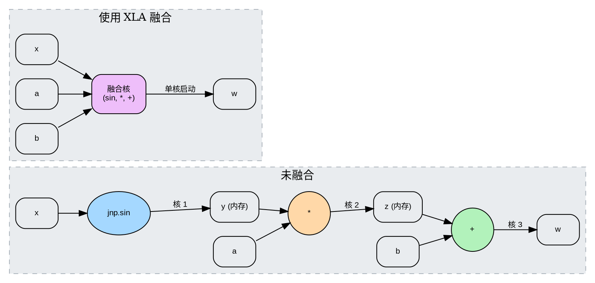

# XLA 编译的作用

来源：[原文](https://apxml.com/zh/courses/advanced-jax/chapter-2-optimizing-jax-code-performance/role-of-xla-compilation)

[返回章节目录](README.md) · [返回课程目录](../README.md)

虽然 `jax.jit` 作为编译 JAX 函数的入口点，但硬件加速器的实际优化和代码生成主要由另一个强大组件 XLA（加速线性代数）负责。XLA 是谷歌开发的特定领域编译器，专门设计用于优化数值计算，特别是涉及线性代数的操作，以在 CPU、GPU 和 TPU 等各种硬件平台上实现高性能。可以将 `jax.jit` 看作是将计算表示（或“图”）传递给 XLA 的机制，XLA 随后应用复杂的优化技术，最后生成可执行代码。

XLA 作用于计算的高级中间表示（IR），通常称为 HLO（高级优化器 IR）。JAX 将你追踪的 Python 函数（内部表示为 `jaxpr`）转换为这种 HLO 格式。XLA 随后在 HLO 图上执行一系列硬件无关和硬件相关的优化遍数，然后将其编译成针对特定目标设备定制的机器码。

### XLA 优化策略

理解 XLA 执行的优化类型有助于你编写能最大程度受益于编译的 JAX 代码。以下是 XLA 采用的一些重要优化技术：

1. **算子融合：** 这是 XLA 最有影响力的优化之一。融合将多个独立操作（或 GPU/TPU 术语中的“核”）组合成一个更大的单一核。考虑一个简单的逐元素操作序列：

   ```python
   import jax
   import jax.numpy as jnp

   def simple_computation(x, a, b):
     y = jnp.sin(x)
     z = a * y
     w = z + b
     return w
   ```

# 未融合

```
# 核 1: 计算 sin(x) -> 中间结果 y (存储在内存中)
# 核 2: 读取 y, 计算 a * y -> 中间结果 z (存储在内存中)
# 核 3: 读取 z, 计算 z + b -> 最终结果 w
```

# 已融合

````
# 融合核: 一次性计算 sin(x)，乘以 a，加上 b，
# 可能会将中间值保存在寄存器中，而无需
# 写回主内存。
```
通过融合这些操作，XLA 避免将中间结果（示例中的 `y` 和 `z`）写回可能较慢的主内存（如 GPU HBM）。它还减少了启动多个独立计算核相关的开销。融合核读取初始输入 `x`，执行所有计算，通常使用寄存器或缓存等更快的片上内存，并且只将最终结果 `w` 写回主内存。这大幅减少了内存带宽使用，并提高了执行速度，特别是对于内存受限的操作。


````

> 算子融合示意图。多个顺序操作被组合成一个更高效的核，减少了内存访问和启动开销。

2. **常量折叠：** XLA 识别计算中仅依赖编译时常量的那部分，并在编译期间对其求值。例如，如果你的函数包含 `jnp.pi * 2.0`，XLA 很可能会在编译后的代码中直接用其数值 ($\approx 6.283$) 替换此表达式，从而节省执行时的计算时间。
3. **代数简化：** XLA 可以应用数学规则来简化表达式。例如，`x * 1.0` 可能会被简化为 `x`，或者 `(x + y) - x` 可能会被简化为 `y`（受浮点数考量影响）。
4. **布局优化：** 多维数组（张量）在内存中的布局方式（例如，行主序与列主序，或 TPUs 上更复杂的平铺/交错）会明显影响性能。XLA 分析计算和目标硬件架构，以确定最佳数据布局，可能会重新排序维度，从而提高矩阵乘法等特定操作的数据局部性和访问效率。
5. **目标特定代码生成：** 在 HLO 图上执行硬件无关优化后，XLA 针对特定后端（CPU、GPU、TPU）。然后它生成低级机器码（例如，对 CPU 和 GPU 使用 LLVM，或对 TPU 使用专用编译器），这些机器码利用目标设备的特定指令集和架构特性，以实现最高性能。

### JAX 到 XLA 的编译流程

整个过程看起来是这样的：

> 经由 XLA，从 JAX 装饰的 Python 函数到优化机器码的编译流程。

JAX 首先追踪你的 Python 函数以生成 `jaxpr` 表示，捕获原始操作序列。此 `jaxpr` 随后被转换（或“降低”）为 XLA 的 HLO 格式。XLA 对此 HLO 图应用其优化遍数，并最终使用后端编译器（例如用于 CPU/GPU 的 LLVM）生成高度优化、设备特定的机器码，这些机器码在你调用 JIT 编译函数时执行。

### 这对 JAX 开发者为何重要

理解 XLA 在后台进行这些优化，有助于你理解为什么某些编码模式在 JAX 中性能表现优于其他模式。例如：

- 使用 `jax.numpy` 编写的向量 (vector)化操作通常能很好地映射到可融合序列，XLA 可以有效优化它们。
- 与单独 JIT 编译许多小型函数相比，使用 `@jit` 装饰的大型、整体式函数通常能为 XLA 提供更大的优化空间。
- 检查 `jaxpr`（在下一节中介绍）可以为你提供关于发送到 XLA 的操作的线索，尽管它不直接显示 XLA 优化的结果。

通过借助 XLA，JAX 提供了一种在 Python 中编写高级数值程序的方法，同时实现与用 C++ 或 CUDA 等低级语言编写的手动优化代码相媲美的性能。后续章节关于检查 `jaxpr`、理解内存布局和识别融合的内容将在此理解之上构建，使你能够分析并进一步调整 JAX 代码以达到最佳性能。

## 参考资料

- [XLA: Accelerated Linear Algebra](https://www.tensorflow.org/xla) — Google (2024)
  Publisher: Google
  提供XLA的官方信息、设计和编译原理。
- [Thinking in JAX: A \`jaxpr\` Primer](https://jax.readthedocs.io/en/latest/jaxpr.html) — JAX developers (2024)
  Publisher: Google (JAX Project)
  说明JAX的内部`jaxpr`表示，该表示会转换为XLA HLO。

---

[上一节](02-%E7%90%86%E8%A7%A3%20JAX%20%E8%AE%A1%E7%AE%97%E5%9B%BE%20%28jaxpr%29.md) · [下一节](04-%E5%86%85%E5%AD%98%E5%B8%83%E5%B1%80%E5%8F%8A%E5%85%B6%E5%AF%B9%E6%80%A7%E8%83%BD%E7%9A%84%E5%BD%B1%E5%93%8D.md)
