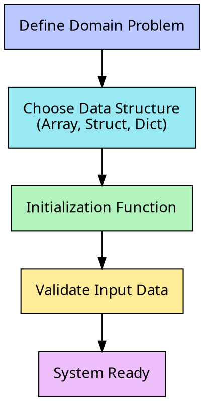

## Project Overview

Julia shines in environments requiring high-performance numerical computing and simulation. This project focuses on building a simulation engine for a dynamic system. You will define a domain relevant to your interests, such as biological population growth, heat diffusion in physics, traffic flow patterns, or even the spread of information in a social network, and implement a model that evolves over time.

Your goal is to construct a modular, efficient program that initializes a system state, applies a set of rules iteratively, manages data input/output, and handles potential runtime errors. This process allows you to experiment with Julia's type system, multiple dispatch, and array manipulation capabilities in a practical context.

## Part 1: System Definition and Initialization

Every simulation begins with a defined state. Think about a problem or phenomenon you are interested in modeling. It should be a system where a grid or a collection of entities changes over distinct time steps based on specific rules.

### Designing the Data Structure
Determine how to represent your system using Julia's core data types. If you are modeling a forest fire, a 2D array might represent the grid of trees. If you are modeling particle physics, a struct or a tuple might represent the coordinates and velocity of each particle.

*   **Select your domain:** Choose a topic that aligns with your background or learning goals.
*   **Define the state:** Create a data structure (Array, Dictionary, or custom Struct) to hold the initial information.
*   **Initialization:** distinct functions are needed to generate the starting state. Investigate generating random data to populate your system or reading initial values from a predefined configuration.

$$ S_{t=0} = \text{initial\_configuration} $$

> Logic flow for initializing and structuring the simulation parameters.

## Part 2: Implementing the Logic Engine

The core of your project lies in the transition rules, how the system moves from time $t$ to time $t+1$. This is where you will apply control flow and modular programming.

### Developing Update Rules
Create functions that take the current state of your system and calculate the next state. Focus on modularity; break down complex logic into smaller, helper functions. For example, if modeling a contagion, separate the logic for "infection probability" from the logic for "movement."

*   **Iterative Logic:** Use loops to apply your rules across the data structure.
*   **Conditional execution:** Implement `if-elseif-else` blocks to handle different states (e.g., if a cell is empty vs. occupied).
*   **Function dispatch:** Experiment with writing multiple versions of a function that behave differently based on the input types. This is a primary feature of Julia.

$$ S_{t+1} = f(S_t, \text{parameters}) $$

### Comparative Implementation
Try implementing the update logic in two different ways. For instance, write one version using explicit `for` loops and another using Julia's vectorized dot syntax (broadcasting). Measure the difference in readability and execution time. Document your findings on which approach felt more natural or performed better for your specific dataset.

## Part 3: Simulation Loop and Data Collection

Once the rules are established, wrap them in a main simulation loop. You need to control how many time steps the simulation runs and track the results.

*   **Time Integration:** Create a control structure that advances the simulation step-by-step.
*   **Data Aggregation:** Instead of just printing the output, store the history of the system. You might store the total energy, population count, or average velocity at each step into a separate array.
*   **Visualizing Progress:** Use the collected data to understand the behavior of your model. Below is an example of how you might represent the magnitude of a variable (like population density or heat) across a 2D plane over time or at a final state.

> 3D Surface representation of simulation density or magnitude distribution.

## Part 4: Robustness and I/O Operations

A professional application must communicate with the outside environment and handle unexpected situations gracefully.

### File Operations
Implement functionality to save the final state of your simulation to a text or CSV file. Conversely, write a function to load configuration parameters (like grid size or initial population) from a file. This allows you to run different scenarios without modifying the code itself.

### Error Handling
Integrate `try-catch` blocks to manage potential failures. 
*   What happens if the configuration file is missing?
*   What if the user inputs a negative number for a parameter that must be positive?
*   How should the system respond if the simulation diverges (e.g., values become infinite)?

Ensure your program provides informative messages rather than crashing silently.

## Part 5: Analysis and Reflection

After building your simulation, shift your focus from coding to analyzing the process and the results.

*   **Performance Analysis:** Did the vectorized implementation outperform the loop-based one? Why do you think that happened based on how Julia handles memory and compilation?
*   **Edge Cases:** Test your model with extreme values (e.g., zero population, maximum temperature). Does the logic hold up, or does it produce physical impossibilities?
*   **Iterative Improvements:** Describe one or two significant changes you made during the development process. Did you have to refactor your data structure? Did you find a bug in your logic that required a rethink?

Connect the technical aspects of Julia you utilized (types, dispatch, packages) to the specific requirements of the problem you chose to solve.
