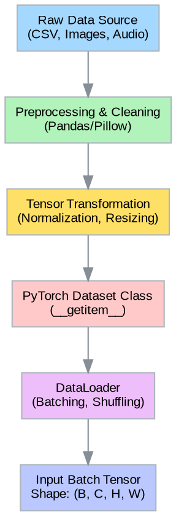

## Project Overview

This project focuses on constructing a complete deep learning workflow using PyTorch. Identify a problem domain of interest, curate a relevant dataset, and design a neural network architecture tailored to that data. The goal is to move past syntax and gain a practical understanding of how tensor manipulation, automatic differentiation, and modular design work together to solve predictive problems.

Your task is to build a classification or regression system. You will define the problem, preprocess the data into tensors, implement a model using `torch.nn`, and create a strong training loop that utilizes `Autograd` for optimization. Throughout the process, document your architectural decisions and the reasoning behind your hyperparameter choices.

### 1. Data Selection and Tensor Transformation

Machine learning models require numerical input. Your first step is to select a dataset that aligns with your professional interests or a specific domain you wish to explore. This could be time-series data from financial logs, images from an industrial inspection process, or text data from customer reviews. Avoid using pre-packaged toy datasets like MNIST or CIFAR-10 directly; instead, look for raw data sources or combine multiple datasets to create a unique challenge.

Once you have your data, you must design a strategy to convert it into PyTorch Tensors. This involves more than just type casting; you need to consider the shape and dimensionality that best represents the information.

*   **Shape Design:** Determine the dimensions of your input tensors (e.g., $(Batch, Sequence, Features)$ for time series or $(Batch, Channels, Height, Width)$ for images).
*   **Normalization:** Implement scaling or normalization strategies to ensure stable gradient flow.
*   **Custom Dataset:** Create a class that inherits from `torch.utils.data.Dataset`. It must implement `__len__` and `__getitem__` to load samples on demand.

> The following diagram illustrates a typical data processing pipeline, moving from raw sources to batched tensors ready for the GPU.



### 2. Architectural Design

With your data ready, design a neural network using `torch.nn.Module`. You have the flexibility to choose between a Convolutional Neural Network (CNN) if your data has spatial structure, or a Recurrent Neural Network (RNN) if it involves sequences. 

Define the `__init__` method to initialize your layers and the `forward` method to define the connectivity. While building your model, investigate the following:

*   **Layer Depth:** Experiment with the number of layers. Does adding more layers improve performance, or does it lead to overfitting given your dataset size?
*   **Activation Functions:** Compare the effects of different activation functions (e.g., ReLU, LeakyReLU, Sigmoid) on convergence speed.
*   **Dimensionality:** Track the tensor shapes as they pass through layers. Mismatched shapes are the most common source of errors in PyTorch.

Document your hypothesis regarding the architecture. Why do you believe this specific arrangement of layers is suitable for your data?

### 3. Implementing the Training Loop

The core of this project is the manual implementation of the training loop. Unlike high-level frameworks that abstract this away, PyTorch requires you to explicitly manage the forward pass, loss calculation, and backward pass.

Write a function that iterates through your `DataLoader`. For each batch, your code should:

1.  Move data to the appropriate device (CPU or GPU).
2.  Perform the forward pass to generate predictions.
3.  Calculate the loss using an appropriate criterion (e.g., `CrossEntropyLoss`, `MSELoss`).
4.  Execute `optimizer.zero_grad()` to reset gradients.
5.  Call `loss.backward()` to compute gradients via Autograd.
6.  Update parameters using `optimizer.step()`.

$$ \theta_{t+1} = \theta_t - \eta \cdot \nabla_\theta J(\theta) $$

Where $\theta$ represents the model parameters, $\eta$ is the learning rate, and $\nabla_\theta J(\theta)$ is the gradient of the loss function.

### 4. Analysis and Iteration

Training a model is rarely a straight line to success. It involves finding a minimum in a complex loss landscape. Visualize your training process to diagnose issues.

*   **Loss Visualization:** Plot the training and validation loss over epochs. Look for divergence which might indicate a learning rate that is too high.
*   **Metric Tracking:** Implement a secondary metric relevant to your problem (e.g., accuracy, F1-score) to evaluate model performance in addition to the loss value.

> The visualization below represents a 3D loss landscape. In practice, you want your optimizer to descend into the 'valleys' (low loss) without getting stuck in local minima.

```plotly
{"layout": {"title": "3D Loss Landscape Visualization", "autosize": true, "scene": {"xaxis": {"title": "Weight 1"}, "yaxis": {"title": "Weight 2"}, "zaxis": {"title": "Loss"}}, "margin": {"l": 0, "r": 0, "b": 0, "t": 40}}, "data": [{"type": "surface", "colorscale": "Viridis", "z": [[10, 9, 8, 9, 10], [9, 6, 5, 6, 9], [8, 5, 2, 5, 8], [9, 6, 5, 6, 9], [10, 9, 8, 9, 10]]}]}
```

Analyze the behavior of your model. If the loss fails to decrease, investigate your data normalization or learning rate. If the model overfits, explore regularization techniques like Dropout. Save your best-performing model using `torch.save` to ensure your work is persistent.

### 5. Reflection and Future Improvements

Conclude your project by critically analyzing the results. 

*   What specific challenges did you encounter during the tensor shaping or data loading phases?
*   How did your choice of optimizer (e.g., SGD vs. Adam) affect the training stability?
*   If you had access to more computational resources or data, how would you expand this architecture?

This project serves as a foundation. By manually handling the tensors and gradients, you gain the necessary understanding to debug complex architectures in advanced deep learning applications.
