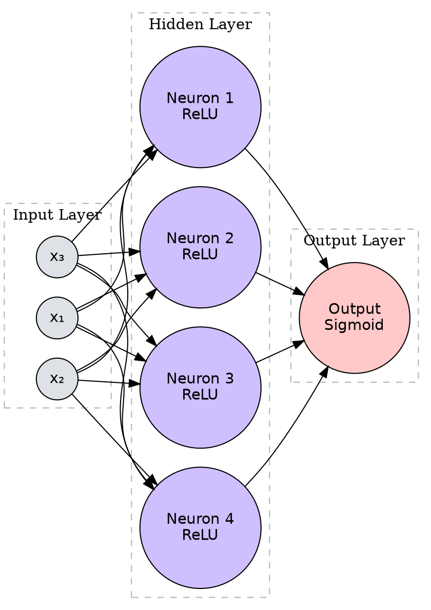

### Defining the Problem Space

Machine learning models are most effective when applied to domains where you have some intuition about the underlying data. Begin by identifying a dataset that interests you personally or relates to a specific field you are studying. This could be anything from sensor data in industrial equipment to financial market indicators, biological signals, or customer behavior logs. If you cannot find a single dataset that fits your needs, explore combining multiple smaller sources to create a unique feature set.

Formulate a clear hypothesis. What pattern are you trying to detect? Whether you are predicting a continuous value (regression) or categorizing inputs (classification), your objective defines the network architecture. Start by performing an exploratory analysis of your features. Neural networks are sensitive to the scale and distribution of input data. Check if your features require normalization or standardization to ensure efficient gradient descent.

### Visualizing High-Dimensional Data

Before feeding data into a network, it is helpful to visualize how separable your classes are or how your features interact. While we cannot easily see past three dimensions, projecting your most significant features into 3D space can reveal clusters or non-linear relationships that a linear model might miss.

> 3D Scatter plot showing the relationship between three input features and a target classification, helping to assess if a non-linear boundary is necessary.

### Architecture and Topology Design

With your data prepared, the next step is constructing the neural network. This involves making structural decisions about the depth (number of layers) and width (neurons per layer) of your model. A common heuristic is to start small and gradually increase complexity.

Design a feedforward network using a framework like TensorFlow or PyTorch. Clearly define your input layer to match your feature dimensions and your output layer to match your prediction target (e.g., a single neuron with sigmoid activation for binary classification, or softmax for multi-class).

Think about the flow of information. Each neuron in a hidden layer represents a learned feature extraction step. Visualizing this flow helps in understanding how inputs are transformed into outputs.

> Diagram illustrating the signal flow through a multi-layer perceptron, detailing the transformation from inputs to weighted sums and activation.

### Activation Functions and Non-Linearity

Review your choice of activation functions. The choice between ReLU, Tanh, or Sigmoid in your hidden layers fundamentally changes how the network learns. For your chosen dataset, experiment with at least two different activation functions. Analyze how this choice affects the training speed and the final accuracy. Does ReLU lead to faster convergence compared to Tanh for your specific distribution of data? Document the behavior of the gradients, specifically, look for signs of vanishing gradients if you use Sigmoid in deep networks.

### The Optimization Landscape

Training a neural network is essentially an optimization problem where the goal is to find a global (or good local) minimum in the loss landscape. The choice of optimizer, SGD, RMSprop, or Adam, dictates the path and speed of this process.

Implement the training loop and monitor the loss function over epochs. Compare the performance of a basic Stochastic Gradient Descent (SGD) against an adaptive learner like Adam. Observe the learning curves. Does one oscillate more than the other? Does one converge faster but settle at a higher loss?

To understand what is happening mathematically, visualize the loss surface. While high-dimensional loss is hard to plot, a 3D surface plot of a simplified loss function with two parameters can demonstrate the challenge of finding the minimum.

Surface plot representing a non-convex loss landscape, showing local minima and the global minimum.

### Regularization and Generalization

A common problem in deep learning is overfitting, where the model memorizes the training data but fails to generalize to new inputs. To test this, try to intentionally overfit your model by increasing the number of layers or neurons significantly without adding regularization. Once you observe a divergence between training accuracy (high) and validation accuracy (low), introduce regularization techniques.

Apply L2 regularization (weight decay) or Dropout to your network. Dropout randomly deactivates neurons during training, forcing the network to learn redundant representations. Quantify the improvement in validation performance after applying these techniques. Explain why the specific regularization method helped in the context of your architecture.

### Iteration and Critical Analysis

Deep learning is rarely a linear process of "build, train, done." It requires iteration. Based on your results from the optimization and regularization steps, refine your model. Perhaps your learning rate was too high, causing instability, or your batch size was too small, leading to noisy updates.

Document your findings. Why did a specific architecture work better for your data? Did the complexity of the model match the complexity of the dataset? Discuss the trade-offs you encountered, such as the balance between training time and accuracy, or model size and generalization capability. If you were to deploy this model in a production environment, what additional steps or safeguards would be necessary?
