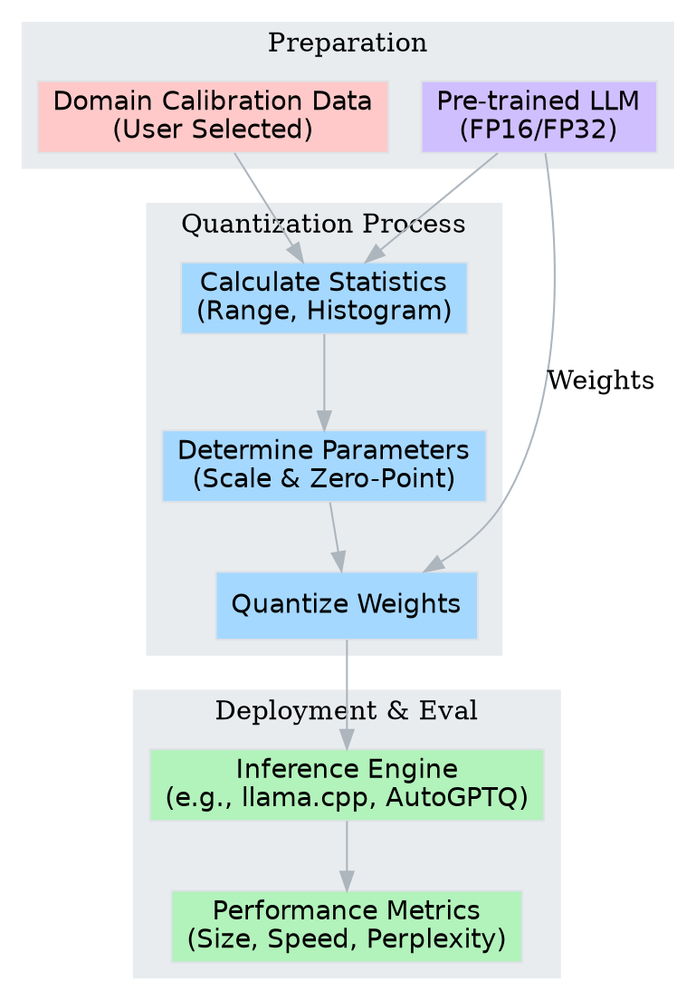

## Project Overview

Deploying Large Language Models (LLMs) often involves a tug-of-war between model capability and available hardware resources. In this project, you will address this trade-off by taking an open-source LLM and optimizing it for a specific deployment scenario of your choice. You will select a domain, curate a representative calibration dataset, apply various quantization techniques, ranging from basic integer casting to advanced calibration-based methods, and evaluate the impact on performance and efficiency.

The goal is not just to make the model smaller, but to understand *what* is lost and *what* is gained during the process, specifically within the context of the data you care about. You will document your decisions, analyze the sensitivity of your model to compression, and produce a deployment-ready artifact.

### The Quantization Pipeline

To help you visualize the workflow you will implement, the following diagram maps the transformation of a model from high-precision training to optimized inference.

> This diagram outlines the flow from raw model and data selection through statistical analysis for parameter determination, leading to the final quantized inference execution.

## Part 1: Scenario Definition and Baselining

Before compressing a model, you must establish what "good" looks like. Choose a specific use case that interests you. This could be a coding assistant, a medical terminology explainer, a creative writing partner, or a financial news summarizer. 

1.  **Select a Model**: Choose an open-source model (e.g., Llama-3-8B, Mistral-7B, or smaller variants like Phi) that fits within your computational constraints for the baseline measurement. 
2.  **Curate a Calibration Dataset**: Gather a text corpus relevant to your chosen use case. This data will be used to calibrate the quantization parameters. Instead of using generic datasets, compile texts that represent the specific language distribution the model will encounter in your scenario.
3.  **Establish Baselines**: Load the model in its original precision (usually FP16 or BF16). Measure:
    *   **Disk Footprint**: The actual file size on disk.
    *   **Memory Usage**: Peak VRAM/RAM usage during inference.
    *   **Inference Latency**: Tokens generated per second.
    *   **Domain Perplexity**: Calculate the perplexity of the model on your curated dataset.

Document these baseline metrics. They will serve as the reference point for all subsequent optimization efforts.

## Part 2: Post-Training Quantization (PTQ) Strategies

In this phase, you will implement Post-Training Quantization. The objective is to reduce the precision of the weights without re-training the model.

### Naive vs. Calibrated Quantization

Start by applying "naive" quantization where you simply cast weights to lower precision (e.g., INT8) based on their absolute max values. Then, move to calibrated quantization. Use your domain-specific dataset to compute the activation ranges. 

Think about how the distribution of your data affects the scale factors ($S$) and zero-points ($Z$) in the quantization equation:

$$W_q = \text{clamp}\left(\left\lfloor \frac{W}{S} + Z \right\rceil, Q_{min}, Q_{max}\right)$$

Compare the perplexity of the naive approach against the calibrated approach. Did the calibration on your specific text improve the model's ability to handle that specific jargon or style?

### Advanced Algorithms (GPTQ / AWQ)

Investigate advanced quantization algorithms such as GPTQ (Generative Pre-trained Transformer Quantization) or AWQ (Activation-aware Weight Quantization). These methods often modify the weights slightly to compensate for the quantization error, considering the curvature of the loss landscape.

*   Apply an algorithm like GPTQ to compress your model to 4-bit precision.
*   Pay close attention to the calibration data used here. Experiment with using a generic dataset versus your domain-specific dataset for the GPTQ calibration phase.
*   Analyze if the aggressive 4-bit compression maintains coherence on your specific tasks.

## Part 3: Formats and Portability (GGUF)

Deployment often happens on consumer hardware (CPUs) or edge devices (MacBooks, mobile). The GGUF format is the standard for this ecosystem. 

1.  **Convert to GGUF**: Use tools like `llama.cpp` to convert your original model into the GGUF format.
2.  **Quantization Levels**: Generate multiple quantized versions (quants), such as `Q4_K_M` (4-bit), `Q5_K_M` (5-bit), and `Q8_0` (8-bit).
3.  **Cross-Platform Inference**: Run these models using a CPU-based inference engine. Note the difference in startup time and generation speed compared to the GPU-based pipelines in Part 2.

## Part 4: Multi-Dimensional Trade-off Analysis

Quantization is rarely a free lunch; it is a trade-off between three main factors: Size, Speed, and Quality. You will now visualize this relationship to determine the "Pareto Frontier" of your optimized models, the set of models where you cannot improve one metric without sacrificing another.

Construct a comprehensive comparison of all the models you have generated (FP16 Baseline, INT8 PTQ, GPTQ-4bit, GGUF-Q4, GGUF-Q8, etc.).

### Visualizing the Trade-off Space

The following 3D visualization demonstrates how you might analyze these conflicting metrics. Create a similar analysis for your own results.

> This 3D scatter plot illustrates the relationship between storage requirements, processing speed, and model quality. Ideally, you want models located in the corner representing low size, low latency, and low perplexity.

## Part 5: Critical Reflection and Documentation

Conclude your project by synthesizing your findings. 

*   **Failure Analysis**: Identify cases where the quantized model failed to capture details that the full-precision model understood. Did the 4-bit model hallucinate more? Did it lose the ability to format code correctly?
*   **Methodology Review**: Why did you choose specific quantization parameters? How did your choice of calibration data impact the final quality? If you had to deploy this to a million users, which specific quantization format and level would you choose and why?
*   **Hardware Implications**: Discuss how your results might change if you were deploying on a mobile phone NPU versus a cloud-based NVIDIA H100.

This documentation should not just list numbers but provide a narrative of the optimization process, highlighting the decisions made to balance theoretical efficiency with practical utility.
