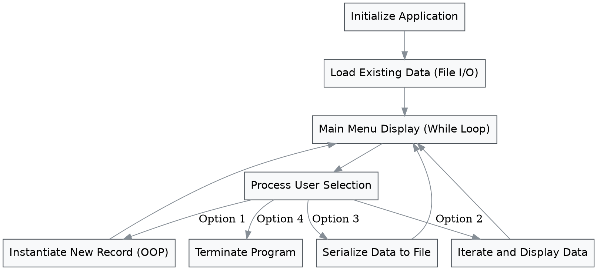

Building a custom software application provides an excellent opportunity to apply foundational programming concepts. You will develop a command-line application designed to track, store, and analyze records specific to a topic you are interested in. This project integrates variables, control structures, data structures, file operations, error handling, and basic object-oriented principles into a single, cohesive program.

### Defining the Application Scope

Think about the topic you have chosen for your project. You might want to track fitness routines, personal finances, daily reading habits, inventory for a hobby, or study hours. Your first objective is to define the specific attributes your records will contain. A fitness tracker might need fields for date, exercise type, duration, and calories burned. A finance manager would require date, description, amount, and category.

Outline the specific fields required for your tracker. Select appropriate data types for each field, such as strings for descriptions, integers or floats for numerical values, and booleans for status indicators. Document these choices and explain why they best represent your target data.

### System Architecture

The application will run in a continuous loop, presenting a menu of options to the user, executing the chosen operation, and returning to the menu until the user decides to exit. 

> Execution flow of the primary application loop processing user commands and managing state.

### Phase 1 Object-Oriented Foundations

Structuring your data efficiently is a core component of software design. Create a Python class that represents a single entry in your tracker. 

Construct an initialization method for your class that accepts the necessary arguments based on the fields you defined earlier. Assign these arguments to instance attributes. Implement additional methods within the class to format the data for display or to perform specific calculations relevant to the entry.

Explain in your documentation how organizing data into objects compares to using parallel lists or basic dictionaries for this specific use case. Detail the benefits and limitations you encountered during implementation.

### Phase 2 Logic and Data Flow

Develop the central logic of your application. You will need a standard Python list to hold the instances of your class in memory during runtime. 

Build functions to handle the primary application features. 

1.  **Adding Records:** Prompt the user for input corresponding to your class attributes. Use proper data type casting and validate the input. If the user enters text when a number is expected, catch the error gracefully and prompt them again.
2.  **Viewing Records:** Iterate through your list of objects and print their details in an organized, readable format. 
3.  **Basic Analytics:** Implement a function that calculates a meaningful metric from your tracked data. 

For example, to compute an aggregate metric such as a simple average for numerical fields, you can apply a formula such as below where $x_i$ represents each individual recorded value and $n$ represents the total number of records:

$$Average = \frac{\sum_{i=1}^{n} x\_i}{n}$$

### Phase 3 File Operations and Resilience

Data persistence ensures your records are not lost when the program closes. Implement file input and output operations to save your collection of objects to a text or CSV file.

Create a function that writes the current state of your list to the file format of your choice. You will need to extract the attributes from your objects and format them correctly before writing to the disk. 

Create a corresponding function that runs when the application starts. This function should read the file, parse the stored text back into individual data points, instantiate new objects using those data points, and append them to your main list.

Incorporate exception handling blocks specifically around your file operations. Anticipate situations where the file might not exist on the first run, or where the file data might be corrupted. Record how your program reacts to these intentional failures and what measures you implemented to prevent application crashes.

### Advanced Data Representation Example

As you collect more data in the domain you are interested in, you can eventually pass your stored datasets into visualization libraries. The following represents how structured, multi-dimensional data extracted from an application like yours can be mapped spatially. 

> Three-dimensional mapping of custom data attributes showing variations across time intervals and category indices.

### Review and Refine

Testing is an integral part of software development. Enter irregular or unexpected data into your application. Feed it empty strings, negative numbers where positive ones are expected, or extremely large values. 

Document the iterations your code went through. Detail at least two significant changes you made to your initial design during the development process. Explain the specific problem that prompted each change and how your alternative approach resolved it. Describe the most challenging aspect of managing data types and file formats simultaneously.

### Extension Pathways

Select at least one of the following extensions to build upon your core application:

*   Implement a search function that allows users to filter records by specific date ranges or text keywords.
*   Refactor your data storage mechanism to use Python's built-in `json` module instead of a plain text or CSV file, explaining the differences in data handling.
*   Add an update and delete feature, allowing users to modify existing records or remove incorrect entries entirely.
*   Create a secondary class that acts as a Data Manager. Move the list storage and file operation methods out of the main script and into this manager class to increase modularity.
*   Write a data export function that generates a summarized report of the user's data into a separate, nicely formatted text file.
