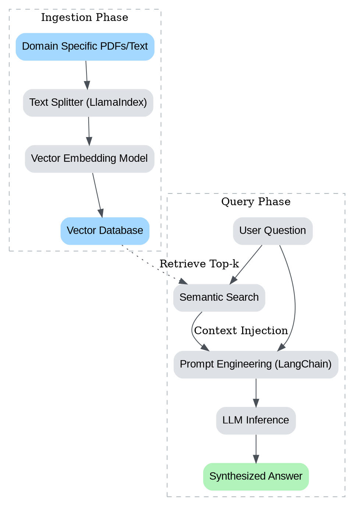

## Project Overview

Raw interactions with Large Language Models (LLMs) are often insufficient for professional applications that require factual accuracy, domain expertise, or access to private data. To bridge this gap, developers must construct reliable workflows that coordinate data retrieval, prompt engineering, and model interaction. This project focuses on building a **Knowledge Synthesis Engine**, a Python application that ingests a curated collection of documents from a specific domain and uses an LLM to answer complex reasoning questions based solely on that data.

Select a specialized field of interest, such as legal case law, bioinformatics papers, technical documentation for a specific software, or historical archives, and build a system capable of acting as an expert assistant in that domain.

### System Architecture

Before writing code, visualize the flow of data through your application. The system requires an ingestion pipeline to process raw text into vector embeddings and a retrieval pipeline to construct prompts dynamically.

> Architecture of a Retrieval-Augmented Generation (RAG) workflow.

## Part 1: Domain Selection and Data Curation

The quality of an LLM workflow is heavily dependent on the quality of its input data. Select a domain you are personally interested in or professionally connected to. Avoid using generic, pre-cleaned datasets found on Kaggle or Hugging Face. instead, curate a small collection of 5 to 15 documents (PDFs, Markdown files, or scraped web pages) that represent "expert knowledge" in your chosen field.

Define the problem statement your tool will solve. For example, if you choose the domain of "Urban Gardening," your problem statement might be: "Helping users diagnose plant diseases based on image descriptions and local climate manuals."

**Requirements:**
*   Identify a specific domain and a corresponding problem to solve.
*   Collect raw data sources relevant to this domain.
*   Document the source of your data and the rationale for selecting these specific documents.

## Part 2: Ingestion and Indexing Strategy

Using **LlamaIndex**, create a data ingestion pipeline. This involves loading your documents, splitting them into manageable text chunks, and converting them into vector embeddings. 

The strategy you choose for chunking text significantly impacts performance. If chunks are too small, the LLM lacks context. If they are too large, you dilute the specific information needed to answer a query.

Experiment with two different chunking strategies (e.g., fixed-size chunking vs. semantic chunking) or different overlap sizes. Observe how these changes affect what information is retrieved during a search.

**Implementation Focus:**
*   Configure a vector store (can be a local store like FAISS or ChromaDB).
*   Implement a loading function that normalizes your text data.
*   Write a script to process and index your data.

## Part 3: Visualizing the Embedding Space

To understand how the model perceives your data, it is helpful to visualize the vector space. High-dimensional vectors (often 1536 dimensions or more) can be reduced to 3 dimensions using techniques like PCA or t-SNE for visualization purposes. This helps verify if semantically similar documents are clustering together.

Generate a visualization of your document chunks. If you implemented two different chunking strategies in Part 2, compare how they populate the vector space.

> Representation of document chunks in 3D space after dimensionality reduction. Clusters typically indicate shared semantic topics.

## Part 4: Workflow Orchestration with LangChain

With your data indexed, use **LangChain** to build the retrieval and generation workflow. This is where you define the logic for how the system interacts with the user.

Develop a chain that performs the following:
1.  **Query Processing:** Accepts a user question.
2.  **Retrieval:** Searches your LlamaIndex vector store for the top $k$ most relevant chunks ($k$ is usually between 3 and 5).
3.  **Prompt Construction:** Dynamically builds a prompt that includes a system instruction (e.g., "You are an expert in X..."), the retrieved context, and the user's question.
4.  **Generation:** Sends the prompt to the LLM and streams the response back.

**Prompt Engineering Task:**
Integrate a specific prompt technique into your Python code. For instance, instruct the model to cite the specific document chunk it used to generate the answer. Or, use a "Chain of Thought" approach where you ask the model to explain its reasoning before giving the final answer.

## Part 5: Testing and Evaluation

Building the system is only half the work; ensuring it is reliable is equally important. Create a "Golden Dataset" consisting of 10 difficult questions related to your domain and the ideal answers you expect. 

Run your workflow against these questions. Compare the generated answers to your ideal answers. You do not need to use complex metrics like BLEU or ROUGE. Instead, perform a qualitative analysis.

**Evaluation Questions:**
*   Did the system retrieve the correct document chunks? (Retrieval accuracy)
*   Did the LLM answer the question based *only* on the provided context, or did it hallucinate external information? (Faithfulness)
*   How did the response change when you modified the prompt structure?

Record your observations. If the system failed on a specific question, investigate why. Was it a retrieval failure (the data wasn't found) or a generation failure (the LLM misunderstood the context)?

## Part 6: Deployment Considerations

Wrap your workflow in a clean interface. This allows you to interact with your model naturally rather than through scripts.

Create a simple command-line interface (CLI) using `argparse` or a lightweight web interface using Streamlit or Gradio. The interface should allow a user to:
1.  Input a query.
2.  View the generated response.
3.  (Optional) See the "Sources" or context chunks used to generate that response.

## Project Retrospective

Conclude your project by documenting your development process. This is not just about the code you wrote, but the decisions you made.

*   **Trade-off Analysis:** Why did you choose the specific LLM provider or model size? What were the cost vs. performance implications?
*   **Challenges:** What was the most difficult part of integrating the libraries? How did you resolve version conflicts or API limitations?
*   **Future Improvements:** If you had more time, how would you improve the retrieval accuracy? Would you add a re-ranking step or use a hybrid search approach?

This documentation serves as evidence of your ability to think critically about LLM systems design, not just writing the implementation code.
