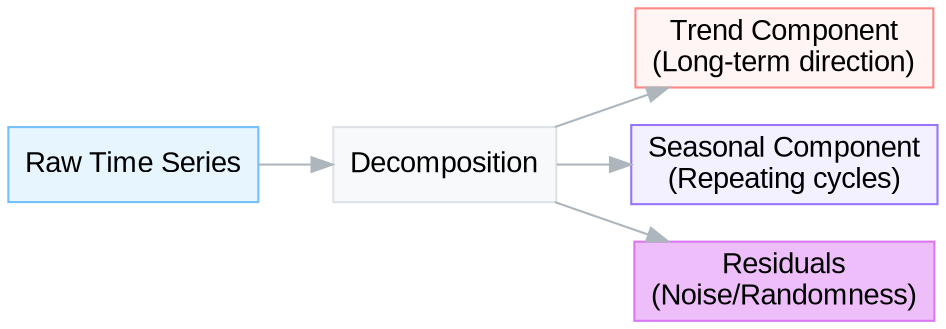

### Project Overview

Building a strong forecasting model requires more than simply fitting an algorithm to a CSV file; it demands a deep understanding of the underlying data generation process. In this project, you will build an end-to-end time series forecasting pipeline. Identify a domain of interest, curate a relevant time series dataset, and address the complexities of making that data suitable for statistical modeling.

The objective is to move past the syntax of the code and focus on the decision-making process: determining why a series is non-stationary, selecting the appropriate differencing order, and validating whether a seasonal component is genuine or noise.

### Part 1: Data Selection and Structural Analysis

Begin by selecting a domain that aligns with your professional interests or curiosity. This could range from infrastructure metrics (e.g., server latency, cloud costs), environmental data (local air quality, river levels), or economic indicators (specific commodity prices, housing inventory). Avoid generic, overused datasets like 'AirPassengers' or standard stock prices unless you are enriching them with external exogenous variables.

Once you have acquired your data, your first task is structural decomposition. Raw time series data is often a composite of conflicting signals. Use decomposition techniques to separate the signal from the noise.

$$ Y_t = T_t + S_t + R_t $$

Where $T_t$ is trend, $S_t$ is seasonality, and $R_t$ is the residual. 

Analyze the resulting components:
*   Is the trend deterministic (consistent direction) or stochastic (random wandering)?
*   Does the seasonality exhibit a fixed period, or does it shift over time?
*   Are the residuals truly random white noise, or do they still contain patterns?


> Separation of time series components allows for targeted modeling of each behavior.

### Part 2: Achieving Stationarity

Statistical models like ARIMA assume that the statistical properties of the series, mean, variance, and covariance, remain constant over time. Most data violates this assumption.

Assess your data using the Augmented Dickey-Fuller (ADF) test. If the p-value suggests non-stationarity, you must transform the data. 

*   **Variance Stabilization:** If the magnitude of fluctuations increases with the trend, apply a Box-Cox or Logarithmic transformation.
*   **Mean Stabilization:** Apply differencing ($y_t - y_{t-1}$) to remove trends. 

Document the minimum order of differencing ($d$) required to satisfy the ADF test. Be careful not to over-difference, as this introduces artificial correlations.

### Part 3: Model Identification and Parameter Selection

With a stationary series, the next step is identifying the internal structure using Autocorrelation (ACF) and Partial Autocorrelation (PACF) plots. This is often the most challenging part of the analysis.

*   **AR terms ($p$):** Look for a sharp cutoff in the PACF plot and a decaying geometric pattern in the ACF.
*   **MA terms ($q$):** Look for a sharp cutoff in the ACF plot and a decaying pattern in the PACF.

If your data exhibits seasonality, you will need to examine lags at multiples of the seasonal period ($s$). For example, in monthly data, examine lags 12, 24, and 36 to determine seasonal AR or MA components.

Construct a grid search strategy to test combinations of parameters around your initial estimates. Use the Akaike Information Criterion (AIC) to compare model fit. The AIC penalizes complexity, helping to prevent overfitting.

```plotly
{"layout": {"title": "Model Performance Surface (AIC) by Parameter", "scene": {"xaxis": {"title": "AR Term (p)"}, "yaxis": {"title": "MA Term (q)"}, "zaxis": {"title": "AIC Score"}}, "margin": {"l": 0, "r": 0, "b": 0, "t": 50}, "height": 500}, "data": [{"type": "mesh3d", "x": [0, 0, 0, 1, 1, 1, 2, 2, 2], "y": [0, 1, 2, 0, 1, 2, 0, 1, 2], "z": [1200, 1150, 1180, 1140, 1110, 1130, 1160, 1125, 1145], "intensity": [1200, 1150, 1180, 1140, 1110, 1130, 1160, 1125, 1145], "colorscale": "Viridis", "opacity": 0.8}]}
```
> Visualization of a grid search result where lower AIC values (darker regions) indicate a better trade-off between model fit and complexity.

### Part 4: Forecasting and Evaluation

Split your data into training and testing sets. In time series, you cannot use random sampling; the split must be temporal (e.g., train on the first 80%, test on the last 20%).

Fit your selected ARIMA or SARIMA model to the training data. Generate forecasts for the test period and compare them against the actual observed values. 

Evaluate the model using multiple metrics:
1.  **RMSE (Root Mean Squared Error):** Penalizes large errors heavily.
2.  **MAPE (Mean Absolute Percentage Error):** Provides interpretability in percentage terms, useful for communicating with non-technical stakeholders.

Analyze the residuals of your final model. They should look like white noise. If the residuals show patterns or significant autocorrelation, your model has failed to capture some information, and you should revisit the parameter selection phase.

### Part 5: Production and Reflection

Simulate a realistic deployment scenario. Imagine you have to present these findings to a decision-maker who is not a data scientist.

*   How would you explain the confidence intervals around your prediction?
*   What happens to your model's accuracy as the forecast horizon increases (e.g., predicting 1 day ahead vs. 30 days ahead)?
*   Identify specific external factors (exogenous variables) that your univariate model fails to capture. For instance, if you are forecasting sales, your model might miss the impact of a sudden marketing campaign.

Reflect on the limitations of your approach. Did the assumption of linearity in ARIMA hold for your dataset? Would a machine learning approach (like LSTM or Prophet) potentially offer advantages for this specific data structure?
